  <samp><b>Hey there! 👋</b></samp>

<h1 align="center">
  <samp>Suryadipta Ghosh</samp>
</h1>

  <samp>A VLSI undergrad and self-taught developer building REST and GraphQL APIs with Node.js and Express, grinding DSA, and shipping tools that solve his own problems.</samp>

##

<h4><b><samp>📚 About me</samp></b></h4>
<samp>
  
- Blitz addict. Plays dubious openings intentionally on [chess.com](https://www.chess.com/member/suryadipta) and blunders.
  
- Not a devoted fan but supports Manchester United.
  
- Occasionally cooks when at home; it's therapeutic.
</samp>

##

  
<b><samp>📊 GitHub Stats</samp></b>

   
  

    
  

##

  
<b><samp>🧑‍💻 Most Used Languages</samp></b>

   
  

    
  

##

  
<b><samp>♟️ Chess stats</samp></b>

   
  

   
  

## 
<h4><b><samp> 🧩 Chess Activity</samp></b></h4>
<!-- CHESS_STORY -->

2026-06-13 · Bullet (1 min) · Playing as Black

Opponent abandoned after 127 moves

Opening: Pirc Defense Classical Variation 4 — Bg7 5.Bg5 O O · ECO B08

Opponent: zenith1604 · 680 rated (32 points above you)

Rating: 656 → 648 (-8)
Streak: 9-game win streak
This month: 161W 47L 2D (Bullet)

Peak hours: mornings
Personal best: 587

<!-- /CHESS_STORY -->

##

  <h4><b><samp>📝 Latest Articles</samp></b></h4>

  
<!-- BLOG-POST-LIST:START -->
- [Here&#39;s why you need a chess stats card](https://dev.to/sxryadipta/heres-why-you-need-a-chess-stats-card-4pml)
- [I made a WhatsApp reminder for important FIFA World Cup matches.](https://dev.to/sxryadipta/i-made-a-whatsapp-reminder-for-important-fifa-world-cup-matches-1al1)
- [JS HTML DOM](https://dev.to/sxryadipta/js-html-dom-43k9)
<!-- BLOG-POST-LIST:END -->
## 

  <h4><b><samp>⚡ Recent Activity</samp></b></h4>

  
<!--RECENT_ACTIVITY:start-->
1. ⬆️ Pushed undefined commit(s) to [sxryadipta/chess-readme-stats](https://github.com/sxryadipta/chess-readme-stats) 
2. 💪 Opened PR [#1731](undefined) in [abhisheknaiidu/awesome-github-profile-readme](https://github.com/abhisheknaiidu/awesome-github-profile-readme) 
3. ⭐ Starred [abhisheknaiidu/awesome-github-profile-readme](https://github.com/abhisheknaiidu/awesome-github-profile-readme) 
4. ⬆️ Pushed undefined commit(s) to [sxryadipta/awesome-github-profile-readme](https://github.com/sxryadipta/awesome-github-profile-readme) 
5. 🔱 Forked [sxryadipta/awesome-github-profile-readme](https://github.com/sxryadipta/awesome-github-profile-readme) from [abhisheknaiidu/awesome-github-profile-readme](https://github.com/abhisheknaiidu/awesome-github-profile-readme) 
<!--RECENT_ACTIVITY:end-->
  
  

##

<h4><b><samp>🌐 Connect with me:</samp></b></h4>

